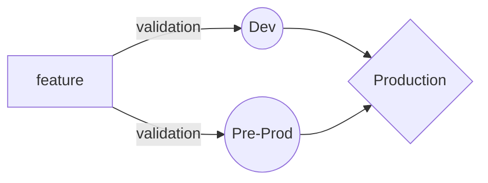

In order to maintain an application long term. Following are the few reasons

1. Spin up a pre-prod/Dev environments 
2. Setup a CI/CD process whenever a new feature or a bug is fixed the automated tests kick in and validates against the dev envrionment and is easy to detect and enhance further
3. Improve the code-coverage and follow standard approval process with peer reviews
4. Setup alerts and monitor the application, virtual machines, any corresponding mount points
5. Streamline and automate the process

Sample Implementation

